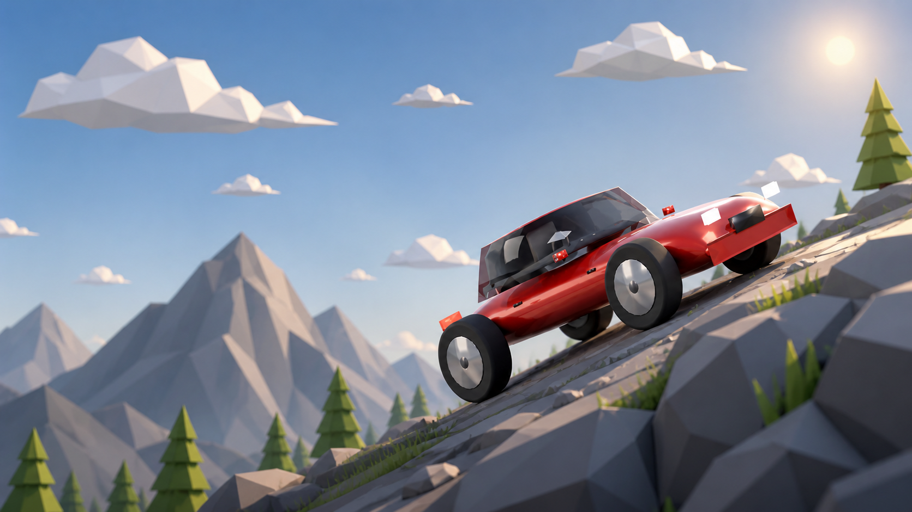
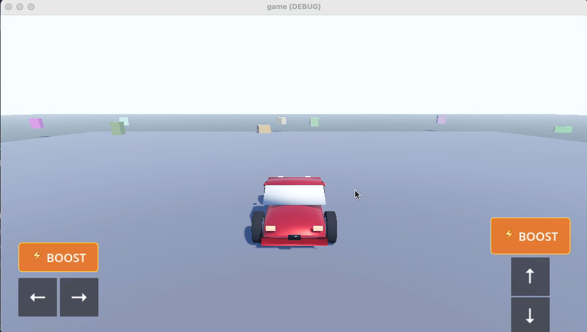
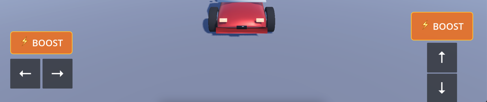
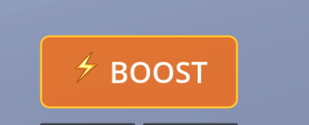
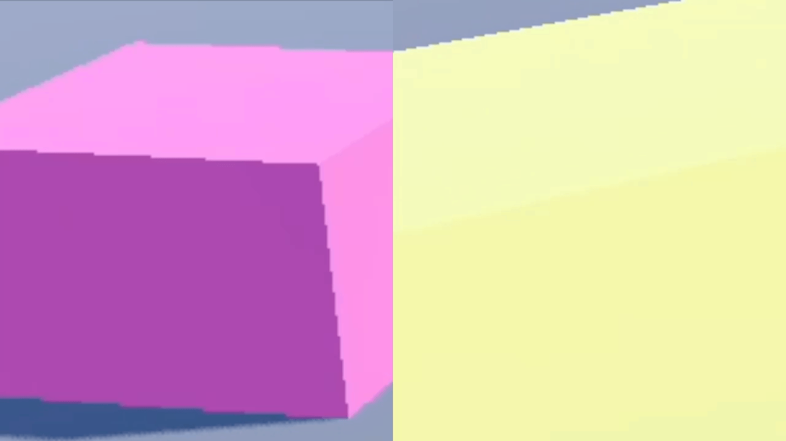

# Inkhelhna-ho-te

A small arcade driving demo built in **Godot 4.3 (Mobile renderer)**. Drive a procedurally-modeled sedan around a flat plane scattered with physics boxes — ram them, knock them over, and watch them light up. Built to run on desktop and iPad with the same controls.



---

## ✨ Features

- **Procedural sedan** rigged in Blender, exported as `.glb` (`assets/car.glb`) — wheels and front-wheel steering driven by an `AnimationPlayer` track named `Drive`.
- **Arcade physics**: `CharacterBody3D` car drives on the ground, `RigidBody3D` boxes get knocked around with realistic mass, gravity, and angular momentum.
- **Cross-input**: keyboard arrows on desktop, four large on-screen panels for touch (multi-touch so you can hold gas + steer + tap boost simultaneously).
- **Boost**: 2-second turbo that scales top speed ×2.5 and box-impact `push_factor` from 0.6 → 2.0, then a 10-second cooldown. Two on-screen ⚡ BOOST buttons (one above each control cluster) **shake hard** during the active boost and grey out during cooldown.
- **Reactive boxes**: every box reacts to being hit:
  - Hit by car (normal): smooth slow color pulse with soft emissive glow
  - Hit by car (boosted): same pulse, but **4× faster** (strobe-like)
  - Hit by another box: **solid matte black** (terminal until the car revives it)
  - Black boxes can be revived by another car ram into a fresh pulse





---

## 🎮 Controls

| Action | Keyboard | Touch |
|---|---|---|
| Accelerate | ↑ | `↑` panel (right cluster, top) |
| Brake / reverse | ↓ | `↓` panel (right cluster, bottom) |
| Steer left | ← | `←` panel (left cluster) |
| Steer right | → | `→` panel (left cluster) |
| Boost | Space | **Either** ⚡ BOOST panel (one above each cluster) |

Touch and mouse are fully completed `pointing/emulate_touch_from_mouse=true` is on, so click-and-drag works on PC for testing.




---

## 🚀 Boost mechanics

- **Press** boost → 2 seconds of overdrive (max speed × 2.5, accel × 3, box `push_factor` 0.6 → 2.0).
- **During** boost: both ⚡ buttons shake violently and turn grey.
- **After** boost ends: 10-second cooldown — buttons stay grey, can't re-trigger.
- **After** cooldown: buttons snap back to orange — ready for the next launch.



---

## 📦 Box state machine

| State | Trigger | Material |
|---|---|---|
| `""` (untouched) | spawn | Random pastel albedo, no emission |
| `"pulse"` | car ramming the box | Albedo cycles random hues, emission ≈ albedo × 0.45 |
| `"pulse"` (fast) | car ramming **while boosting** | Same cycle, 4× faster (~0.4 s/color) |
| `"black"` | another box rolls into this one | Matte black, no emission, no further reaction (until a car revives it) |

A black box hit by the car returns to the `pulse` state — slow if not boosted, fast if boosted.



---

## 🗂 Project structure

```
game/
├── project.godot                  Godot 4.3 Mobile project, landscape, viewport 1920×1080
├── icon.svg
├── assets/
│   └── car.glb                    Procedural sedan from Blender (rigged + Drive animation)
├── scenes/
│   └── world.tscn                 Main scene — sky, ground, car, boxes spawner, HUD
└── scripts/
    ├── car_controller.gd          CharacterBody3D arcade driving + boost
    ├── box.gd                     Per-box pulse / black state machine
    ├── boxes_spawner.gd           Spawns ~35 random RigidBody3D boxes around the world
    └── touch_ui.gd                On-screen panels + multi-touch + boost button shake/grey
```

---

## 🏃 Running

1. Open the `game/` folder as a project in **Godot 4.3** (Mobile renderer).
2. Let Godot import `assets/car.glb` on first open (it'll cache to `.godot/imported/`).
3. Press **F5** (or the play button). Pick `world.tscn` if Godot asks for the main scene.

For an iPad build, Project → Export → iOS, or wire it up to TestFlight via Xcode.

---

## 🔧 Tunables

Most knobs are exposed via `@export` in their script. Selected highlights:

| File | Property | Default | Effect |
|---|---|---|---|
| `car_controller.gd` | `max_speed` | 18 | Top speed in m/s |
| `car_controller.gd` | `boost_duration` | 2.0 | How long boost is active (s) |
| `car_controller.gd` | `boost_cooldown` | 10.0 | Wait between boosts (s) |
| `car_controller.gd` | `boost_speed_mult` | 2.5 | Top-speed multiplier while boosting |
| `car_controller.gd` | `boost_push_factor` | 2.0 | Impulse-on-impact while boosting |
| `car_controller.gd` | `normal_push_factor` | 0.60 | Impulse-on-impact at normal speed |
| `boxes_spawner.gd` | `box_count` | 35 | How many boxes to spawn |
| `boxes_spawner.gd` | `area_radius` | 50.0 | Spawn area half-extent (m) |
| `boxes_spawner.gd` | `car_clear_radius` | 7.0 | No-spawn zone around the car |
| `boxes_spawner.gd` | `density` | 0.5 | Mass per cubic meter (lighter = bouncier) |
| `box.gd` | `transition_duration` | 1.6 | Base color cycle period (s) at pulse_speed = 1 |
| `touch_ui.gd` | `shake_amount` | 16.0 | Pixels of jitter on the boost buttons during boost |

---


## 📄 License

See [LICENSE](LICENSE).
